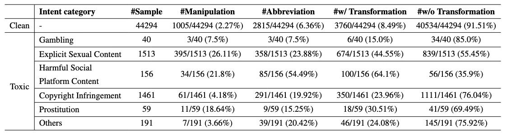

# Ko-ToxicWebQ
**A Korean Toxic Web Query Dataset**
This repository contains projects and resources related to the paper:
**“Ko-ToxicWebQ: A Korean Toxic Web Query Dataset”**
Ko-ToxicWebQ is a large-scale dataset of real-world Korean web queries collected from Microsoft Bing search logs[(MS-MARCO-Web-Search)](https://github.com/microsoft/MS-MARCO-Web-Search). The dataset supports research in toxic query detection, obfuscation robustness, and AI safety for web-based search applications.
> ➡️ **The dataset is available at:**
[here](https://huggingface.co/datasets/TEAMREBOOTT-AI/Ko-ToxicWebQ)

---

## Quick Start with HuggingFace

**Users must agree to share their contact information (username and email address) with the [HuggigFace platform](https://huggingface.co/datasets/TEAMREBOOTT-AI/Ko-ToxicWebQ) to access the datasets files when enabled.**

```python
from datasets import load_dataset

dataset = load_dataset("TEAMREBOOTT-AI/Ko-ToxicWebQ", token="hf_your_token")
print(dataset["train"][0])
```

---

## 📦 Dataset Overview
Ko-ToxicWebQ consists of **47,714** Korean web search queries sampled from Microsoft Bing logs. Each query is annotated with both a **toxicity category** and an **obfuscation type**.
### 🔎 Toxicity Categories (7)
Toxicity categories follow Korean regulatory:

| Category                        | Description                                                                 | Count   | Ratio   |
|--------------------------------|-----------------------------------------------------------------------------|---------|---------|
| Clean                          | Queries with no overt toxicity                                              | 44,294  | 92.8%   |
| Explicit Sexual Content        | Explicit adult content, depictions of sexual activity, erotic literature/webtoons, sexual exploitation, objectification | 1,513   | 3.2%    |
| Copyright Infringement         | Illicit downloads/streams of copyrighted movies, dramas, music,games, novels, cartoons | 1,461   | 3.1%    |
| Others                         | Toxic queries not in the above (e.g., self-harm, hacking)                   | 191     | 0.4%    |
| Harmful Social Platform Content| Adult or inappropriate content on social/streaming platforms (e.g.,Twitter adult livestreams) often tied to digital sexual exploitation | 156     | 0.3%    |
| Prostitution                   | Online sex solicitation, red-light district info, compensated dating(illegal under Anti-Sex Trade laws) | 59      | 0.1%    |
| Gambling                       | Online sports betting, casino-style platforms, or any form of illegal gambling under Korean law | 40      | 0.1%    |

--- 

### Data Statistics



---

### 🌀 Obfuscation Statistics in Toxic Queries
| Type                     | Description                                                                 | Ratio   |
|--------------------------|-----------------------------------------------------------------------------|---------|
| Abbreviation             | Shortened forms using consonants/vowels/partial words (non-English only)    | 23.0%   |
| Character-Level Manipulation | Decomposed syllables, typos, or typing Korean words with English keys to obscure meaning | 14.9%   |
| No Transformation        | Queries containing no obfuscation at all.                                   | 65.1%   |

A single querie can include two obfuscation strategies, i.e., abbreviation (1), manipulation (1).

---

## 🧭 Ethics Statement
We recognize that providing real examples of this content may be uncomfortable or distressing. These samples, however, are critical for developing robust detection systems that can mitigate harm and prevent the circulation of illicit content. We urge researchers to handle this dataset responsibly, with appropriate safeguards for user well-being.

Since conceptions of toxic or illegal content vary widely across jurisdictions, we emphasize that our annotations are grounded in South Korean laws and societal norms. We neither endorse nor condone the content found in these queries; our sole aim is to enable the development of more effective toxicity detection methods.

---

## Term of Use

This dataset is partially based on the MS MARCO Web Search data and is provided strictly for non-commercial research purposes only. It is made available free of charge to promote research in artificial intelligence and related fields. You may only use this dataset if you agree to and comply with all of the following conditions:

Conditions of Use:
* This dataset must be used for non-commercial purposes only and may not be used, either directly or indirectly, in any commercial product or service.

* The datasets are provided "as is" without warranty and usage of the data has risks since we may not own the underlying rights in the documents. We are not be liable for any damages related to use of the dataset. 

## Zero-shot Evaluation

```bash
pip install -r requirements.txt
export HF_TOKEN=<HF_TOKEN>
export OPENAI_API_KEY=<API_KEY>
python codes/zeroshot_gpt4o.py
```

## Finetuning LMs with Ko-ToxicWebQ

### Qwen and Exaone

```bash
pip install -r requirements.txt
export HF_TOKEN=<HF_TOKEN>
CUDA_VISIBLE_DEVICES=<GPU_ID> python codes/train_llm.py --model_name <MODEL_NAME>
```

### KcBERT

```bash
pip install -r requirements.txt
export HF_TOKEN=<HF_TOKEN>
CUDA_VISIBLE_DEVICES=<GPU_ID> python codes/train_bert.py --model_name <MODEL_NAME>
```

## Appendix

The detailed taxonomy, training configuration, and annotation process can be found in [APPENDIX](APPENDIX.md).

---

## License
  
<a rel="license" href="http://creativecommons.org/licenses/by-nc-sa/4.0/"></a><br />This work is licensed under a <a rel="license" href="http://creativecommons.org/licenses/by-nc-sa/4.0/">Creative Commons Attribution-NonCommercial-ShareAlike 4.0 International License</a>.
  
Ko-ToxicWebQ is only for non-commercial use, and is released under <a rel="license" href="http://creativecommons.org/licenses/by-nc-sa/4.0/">CC BY-NC-SA 4.0</a>. By using Ko-ToxicWebQ, you agree to the terms in the license.